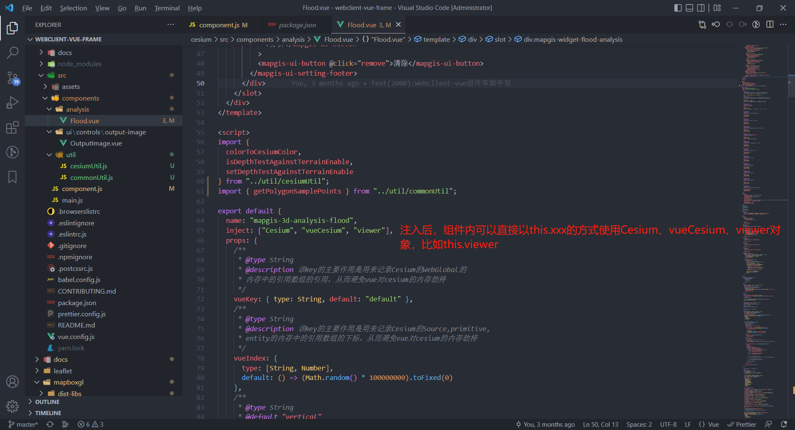

## Webclient-vue-Frame

Webclient-vue 脚手架，用于 Cesium、Leaflet 的扩展组件开发。

### 1、代码结构

```text
├─.storybook                     -- storybook配置文件
├─cesium                         -- Cesium组件库的代码结构
│  ├─docs                        -- Cesium组件库的Vuepress文档说明
│  │  ├─.vuepress                -- Cesium组件库的配置文件
│  │  ├─api                      -- Cesium组件库的API详细说明文档
│  │  ├─guide                    -- Cesium组件库的介绍、安装部署及模块说明
│  │  └─version                  -- Cesium组件库的版本更新说明
│  ├─node_modules
│  ├─src                         -- Cesium组件库源代码
│      ├─assets
│      │  └─image
│      └─components              -- Cesium组件
│          ├─Analysis
│          ├─UI
│          │  └─Controls
│          │      └─OutputImage
│          └─Util
├─leaflet                        -- Leaflet组件库的代码结构
│  ├─docs                        -- Leaflet组件库的Vuepress文档说明
│  ├─node_modules
│  ├─src                         -- Leaflet组件库源代码
├─node_modules
├─stories                        -- storybook示例源代码
    ├─assets                     -- storybook示例资源
    ├─data                       -- storybook示例数据
    ├─mapgis2d                   -- Leaflet(二维)组件示例
    ├─mapgis3d                   -- Cesium(三维)组件示例
    ├─public
    │  └─cesium                  -- Cesium js库
    └─style
```

### 2、新建组件

以在 Webclient-Vue-Cesium-Example 中新建 洪水淹没 组件为例，展示如何新建组件。

1. 组件内部使用独立的 VUE 注入机制[provide/inject](https://vuejs.org/v2/api/#provide-inject)

   Webclient-Vue-Cesium-Example 是针对原始的 cesium 脚本的封装。

   一个插件组件本质上还是通过 Vue 组件的方式，核心思想是通过获取 根组件`mapgis-web-scene`中的 `Cesium` 和 `vueCesium` 以及 `viewer` 对象来进行对应的拓展功能。

   当`mapgis-web-scene`组件创建的时候，必须等到地图初始化加载完毕后，然后才会渲染子组件 同时通过 provide 的方式提供下面三个对象:

   ::: tip

   1. `Cesium` @mapgis/cesium
   2. `vueCesium` cesium 对象的存储管理器
   3. `viewer` mapgis Cesium.viewer 对象

​       :::

只要是注入了上面的属性,你就可以添加地图要素或者执行对应的地图方法。 注入方法如下：

```js
inject: ["Cesium", "vueCesium","viewer"]
```

封装插件的核心思想是： 保持 Vue 本身的声明规范，这样做可以容易封装额外的控制组件和图层组件。同时也容易封装第三方插件，适应不同的业务需求。

2. 新建 洪水淹没 组件。

   a. 在cesium/src/components中新建Flood.vue文件，并且在Flood.vue文件注入["Cesium", "vueCesium","viewer"]。

   

   b. 在cesium/src/component.js中导出组件。编译后，在其他项目中use后，即可直接使用新建的组件。

   

### 3、编译

如果您需修改源码，可自行编译打包生成 Cesium、Leaflet 的地图组件库、API 文档。

以`Cesium`为例，首先进入对应的目录下

0. 进入目录

   ```sh
   cd /path/to/cesium
   ```

1. 安装依赖（如果新建组件中没有新增的依赖，这里依赖只需在第一个开发的时候，安装）

   ```sh
   npm install
   # 或者
   yarn
   ```

2. 地图组件编译（组件新建完后，需要编译）

   ```sh
   npm run build           #编译 将源代码编译成Vue的地图组件
   # 或者
   yarn build
   ```

3. API 文档生成
   ```sh
   npm run docs:serve      #服务实时预览-生成API参考文档
   # 或者
   yarn docs:serve
   
   npm run docs:build      #编译打包预览-生成API参考文档
   # 或者
   yarn docs:build
   ```

### 4、新建 storybook 示例调试

1. 安装 storybook 依赖
   ```sh
   cd /path/to/WebClient-Vue-Frame
   yarn
   ```
   
2. 新增 storybook 示例
   详见[create_storybook.md](./docs/create_storybook.md)

### 5、本地调试

以`Cesium`为例，首先进入对应的目录下，假设用户存在 2 个工程：1.WebClient-Vue-Frame 2.项目工程 MyProject

1. 进入对应的目录

   ```sh
   cd /path/to/WebClient-Vue-Frame/cesium
   ```

2. 执行本地链接操作

   ```sh
   npm link
   或者
   yarn link
   ```

3. 进入自己的项目工程

   ```sh
   cd /path/to/MyProject
   ```

4. 指定连接的 WebClient-Vue-Frame 库

   ```sh
   npm link @mapgis/webclient-vue-cesium-example
   ```

**如何在一张图微件库中使用新建组件，并加到一张图中?详见[add-component-to-mapgis-pan-spatial-map.md](./docs/add-component-to-mapgis-pan-spatial-map.md)**

### 6、常见问题

1. yarn过程中出现lru-cache@8.0.4: The engine "node" is incompatible with this module. Expected version...

   ```sh
   yarn config set ignore-engines true
   ```