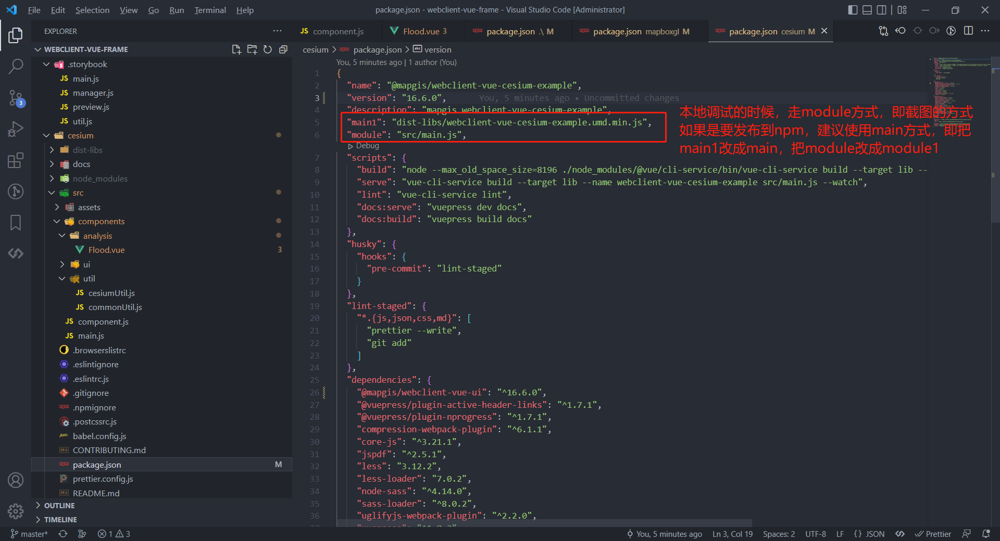

## Webclient-vue-Frame

Webclient-vue 脚手架，用于 Cesium、Mapboxgl 的扩展组件开发。

### 1、代码结构

```text
├─.storybook                     -- storybook配置文件
├─cesium                         -- Cesium组件库的代码结构
│  ├─docs                        -- Cesium组件库的Vuepress文档说明
│  │  ├─.vuepress                -- Cesium组件库的配置文件
│  │  ├─api                      -- Cesium组件库的API详细说明文档
│  │  ├─guide                    -- Cesium组件库的介绍、安装部署及模块说明
│  │  └─version                  -- Cesium组件库的版本更新说明
│  ├─node_modules
│  ├─src                         -- Cesium组件库源代码
│      ├─assets
│      │  └─image
│      └─components              -- Cesium组件
│          ├─analysis
│          ├─uI
│          │  └─controls
│          │      └─output-image
│          └─util
├─mapboxgl                       -- Mapboxgl组件库的代码结构
│  ├─docs                        -- Mapboxgl组件库的Vuepress文档说明
│  │  ├─.vuepress                -- Mapboxgl组件库的配置文件
│  │  ├─api                      -- Mapboxgl组件库的API详细说明文档
│  │  ├─guide                    -- Mapboxgl组件库的介绍、安装部署及模块说明
│  │  └─version                  -- Mapboxgl组件库的版本更新说明
│  ├─node_modules
│  ├─src                         -- Mapboxgl组件库源代码
│      ├─assets
│      │  └─image
│      └─components              -- Mapboxgl组件
│          └─controls
├─node_modules
├─stories                        -- storybook示例源代码
    ├─assets                     -- storybook示例资源
    ├─data                       -- storybook示例数据
    ├─mapgis2d                   -- Mapboxgl(二维)组件示例
    ├─mapgis3d                   -- Cesium(三维)组件示例
    ├─public
    │  └─cesium                  -- Cesium js库
    └─style
```

### 2、编码规范

1. 文件夹名命名规则：以全部小写或者短横线连接式命名，示例： `analysis` 或者 `scene-projector`
2. js 文件名命名规则：对外以大驼峰式命名，示例：`LayerType.js`；对内以小驼峰式命名，示例：`cityCenter.js`
3. vue 文件名命名规则：以大驼峰式命名，示例： `AspectSlope.vue`
4. vue 组件名(组件内部`name`字段)命名规则：二维组件以`mapgis-`开头，示例：二维绘制组件的 name 为 `mapgis-draw`；三维组件以`mapgis-3d-`开头，示例：三维绘制组件的 name 为 `mapgis-3d-draw`

### 3、新建组件和对应API编写

   三维组件，详见[create-component-3d.md](./docs/create-component-3d.md)

   二维组件，详见[create-component-2d.md](./docs/create-component-2d.md)

### 4、编译

如果您需修改源码，可自行编译打包生成 Cesium、Mapboxgl 的地图组件库、API 文档。

首先进入对应的目录下

0. 进入目录

    ```sh
    cd /path/to/cesium  # 三维
    # 或者
    cd /path/to/mapboxgl # 二维
    ```

1. 安装依赖（如果新建组件中没有新增的依赖，这里依赖只需在第一次开发的时候，安装）

   ```sh
   npm install
   # 或者
   yarn
   ```

2. 地图组件编译（组件新建完后，需要编译）

   ```sh
   npm run build           #编译 将源代码编译成Vue的地图组件
   # 或者
   yarn build
   ```

3. API 文档生成

   ```sh
   npm run docs:serve      #服务实时预览-生成API参考文档
   # 或者
   yarn docs:serve

   npm run docs:build      #编译打包预览-生成API参考文档
   # 或者
   yarn docs:build
   ```

### 5、新建 storybook 示例调试

1. 安装 storybook 依赖
   ```sh
   cd /path/to/WebClient-Vue-Frame
   yarn
   ```
2. 新增 storybook 示例
   详见[create_storybook.md](./docs/create_storybook.md)

### 6、本地调试

首先进入对应的目录下，假设用户存在 2 个工程：1.WebClient-Vue-Frame 2.项目工程 MyProject

1. 进入对应的目录

   ```sh
   cd /path/to/WebClient-Vue-Frame/cesium # 三维
   # 或者
   cd /path/to/WebClient-Vue-Frame/mapboxgl # 二维
   ```

2. 执行本地链接操作

   ```sh
   npm link
   # 或者
   yarn link
   ```

3. 进入自己的项目工程

   ```sh
   cd /path/to/MyProject
   ```

4. 指定连接的 WebClient-Vue-Frame 库

   ```sh
   npm link @mapgis/webclient-vue-cesium-example # 三维
   # 或者
   npm link @mapgis/webclient-vue-mapboxgl-example # 二维
   ```



**如何在一张图微件库中使用新建组件，并加到一张图中?详见[add-component-to-mapgis-pan-spatial-map.md](./docs/add-component-to-mapgis-pan-spatial-map.md)**

### 7、常见问题

1. yarn 过程中出现lru-cache@8.0.4: The engine "node" is incompatible with this module. Expected version...

   ```sh
   yarn config set ignore-engines true
   ```
