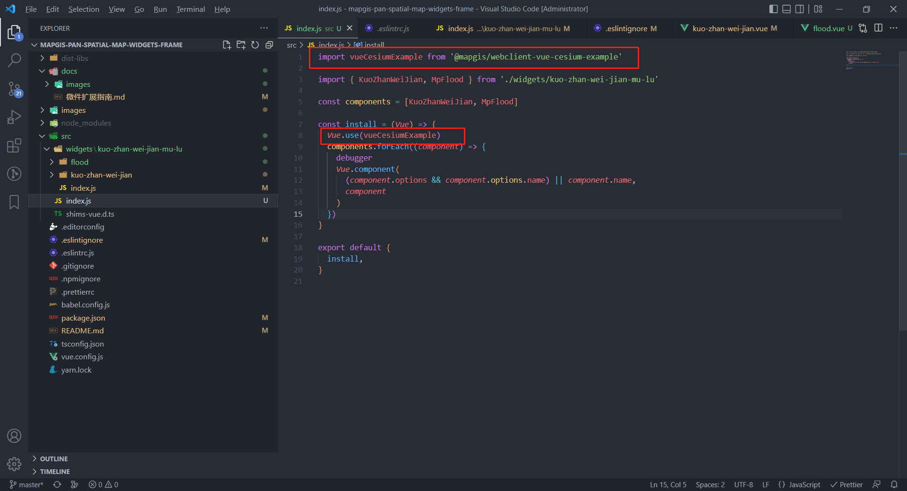
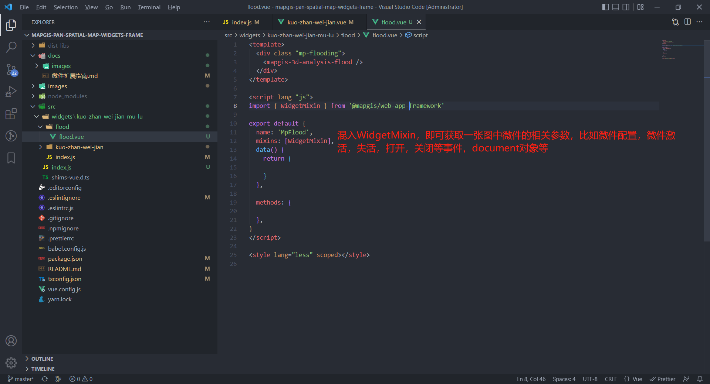
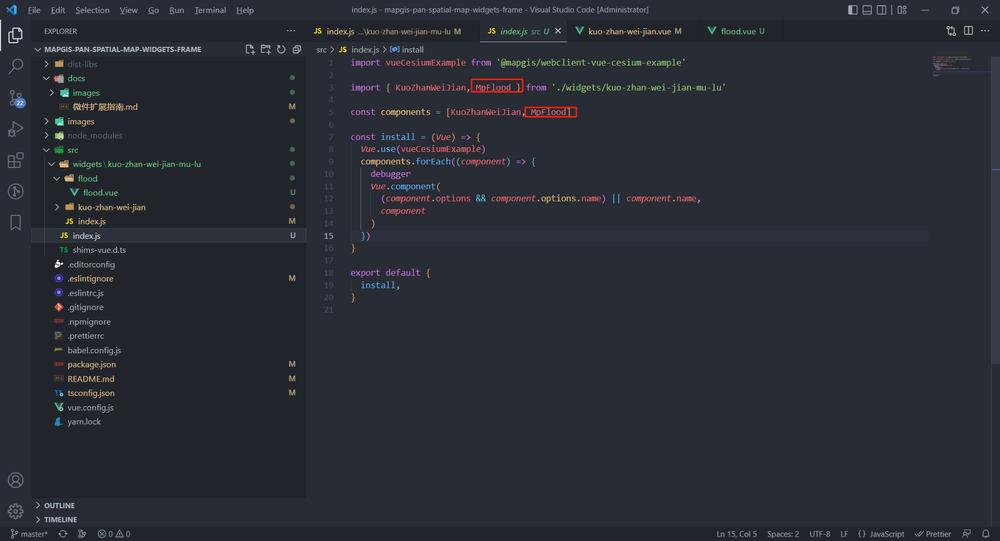
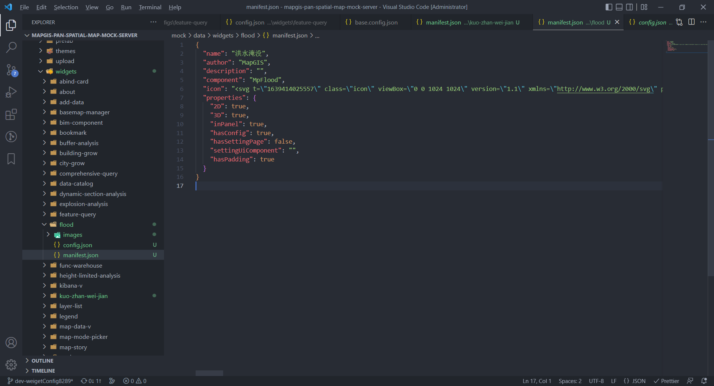
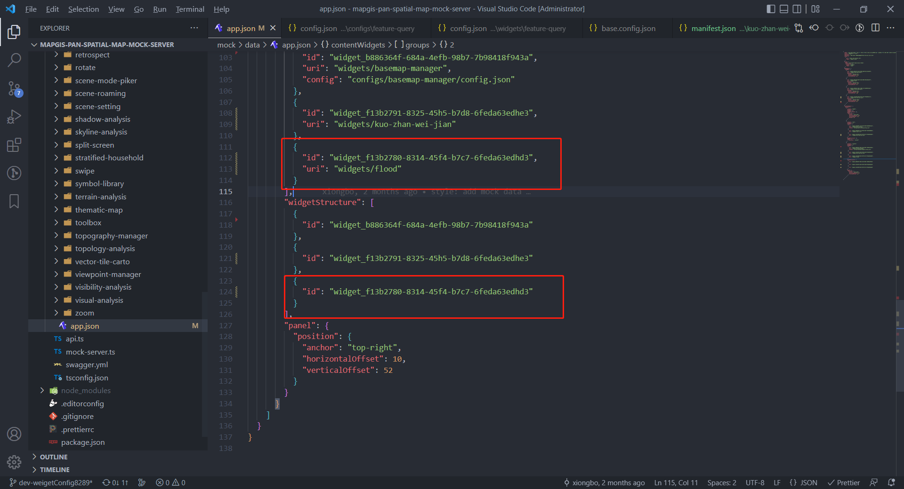

## 在一张图微件库中使用新建组件，并加到一张图中

### 1、在微件库中使用新建组件

1. 下载mapgis-pan-spatial-map-widgets-frame微件库代码, 并切到mapgis-pan-spatial-map-widgets-frame目录下，安装相应的依赖。

   ```js
   yarn  // 安装依赖
   yarn link @mapgis/webclient-vue-cesium-example // link新建组件包
   ```

   > 如果新建组件包已传入npm，则可以直接在mapgis-pan-spatial-map-widgets-frame/package.json的dependencies对象中引入@mapgis/webclient-vue-cesium-example，link这步就可以省掉了。

2. 在mapgis-pan-spatial-map-widgets-frame/src/index.ts中引入@mapgis/webclient-vue-cesium-example，并use。

   

3. 在mapgis-pan-spatial-map-widgets-frame/src/widgets中，新建 洪水淹没 微件。

   

4. 在mapgis-pan-spatial-map-widgets-frame/src/widgets/index.js中，导出新建微件。

   

5. 在mapgis-pan-spatial-map-widgets-frame/src/index.ts中，install将新建微件注入到Vue中。

   

## 2、在一张图中添加新建微件

1. 下载mapgis-pan-spatial-map-pro-antd，在mapgis-pan-spatial-map-pro-antd/packages/src/main.js中，引入@mapgis/mapgis-pan-spatial-map-widgets-frame，并use。

   

2. 在一张图数据配置中，apps/widgets中新增flood文件夹，配置manifest.json和config.json信息。

   

3. 在app.json或者管理平台中，将 洪水淹没 微件配置到一张图中。

   

4. 最终效果。

   