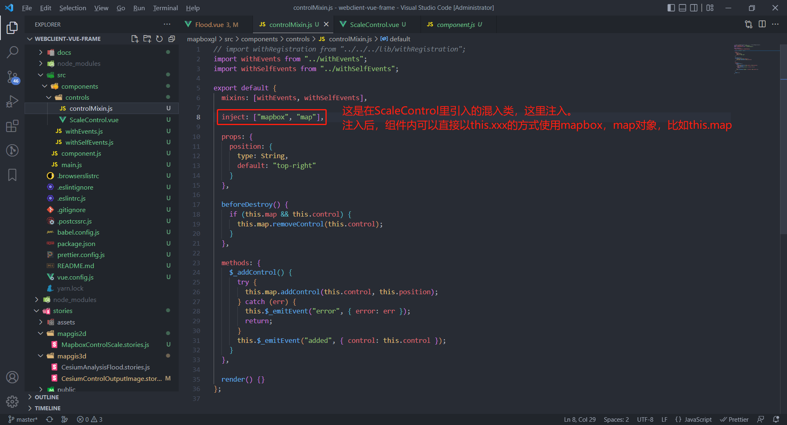
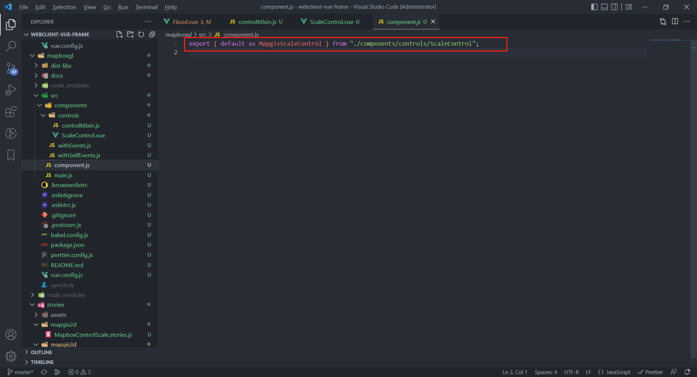
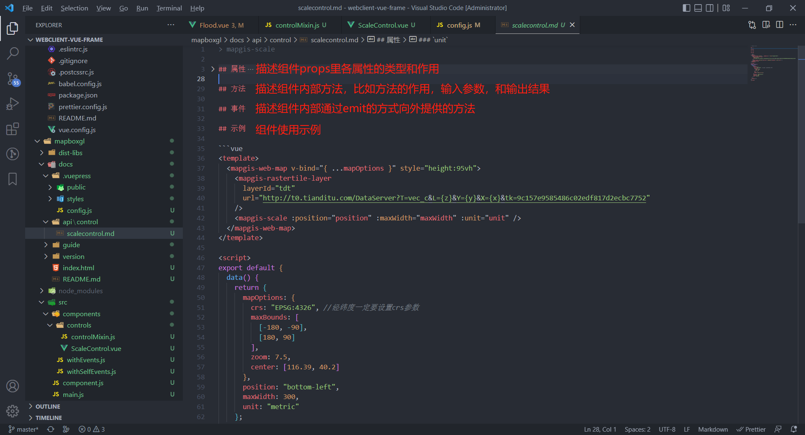
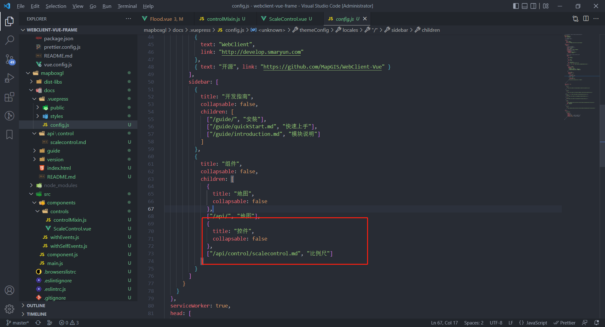
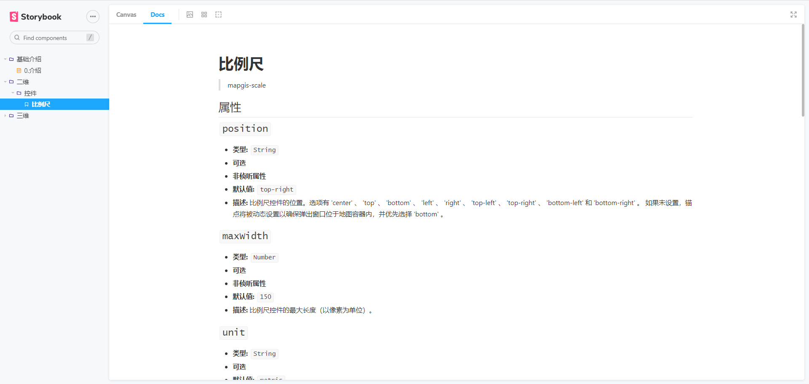

### 新建二维组件和对应的API文档

#### 新建组件

1. 组件内部使用独立的 VUE 注入机制[provide/inject](https://vuejs.org/v2/api/#provide-inject)

   Webclient-Vue-Mapboxgl-Example 是针对原始的 mapboxgl 脚本的封装。

   一个插件组件本质上还是通过 Vue 组件的方式，核心思想是通过获取 根组件`mapgis-web-map`中的 `mapbox` 和 `map`对象来进行对应的拓展功能。

   当`mapgis-web-map`组件创建的时候，必须等到地图初始化加载完毕后，然后才会渲染子组件 同时通过 provide 的方式提供下面三个对象:

   > a. `mapbox` @mapgis/mapbox-gl
   >
   > b. `map` mapboxgl的map对象
   >

只要是注入了上面的属性,你就可以添加地图要素或者执行对应的地图方法。 注入方法如下：

```js
inject: ["mapbox", "map"];
```

封装插件的核心思想是： 保持 Vue 本身的声明规范，这样做可以容易封装额外的控制组件和图层组件。同时也容易封装第三方插件，适应不同的业务需求。

2. 新建组件

   以在 Webclient-Vue-Mapboxgl-Example 中新建`比例尺`组件为例，展示如何新建组件。

   a. 在 mapboxgl/src/components 中新建 ScaleControl.vue 文件，并且在 ScaleControl.vue 文件注入`mapbox`, `map`。

   

   b. 在 mapboxgl/src/component.js 中导出组件。编译后，在其他项目中 use 后，即可直接使用新建的组件。

   

#### 编写对应的API文档

1. 在mapboxgl/docs/api中新建control文件夹，在新建文件夹里新建scalecontrol.md。API文档主要包含属性，方法，事件，和示例。

   

2. 在mapboxgl/docs/.vuepress/config.js中，将新增的scalecontrol.md引入。

   

3.  在storybook示例中可预览新增的API文档。

   

   